# Capturas de pantalla

Las siguientes capturas fueron tomadas con Playwright sobre la aplicacion local en `http://localhost:3000`, usando usuarios demo de los roles administrador, vendedor y mayorista.

## Pantallas publicas

### Inicio

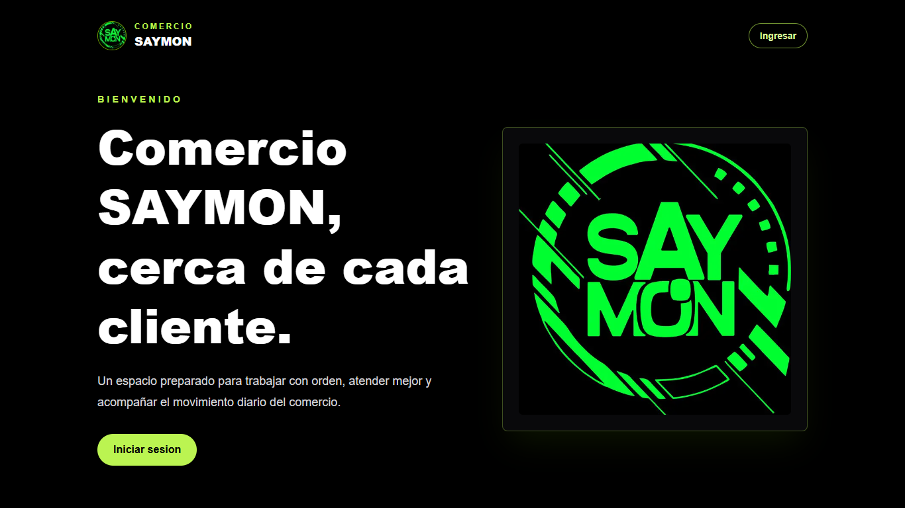

### Login

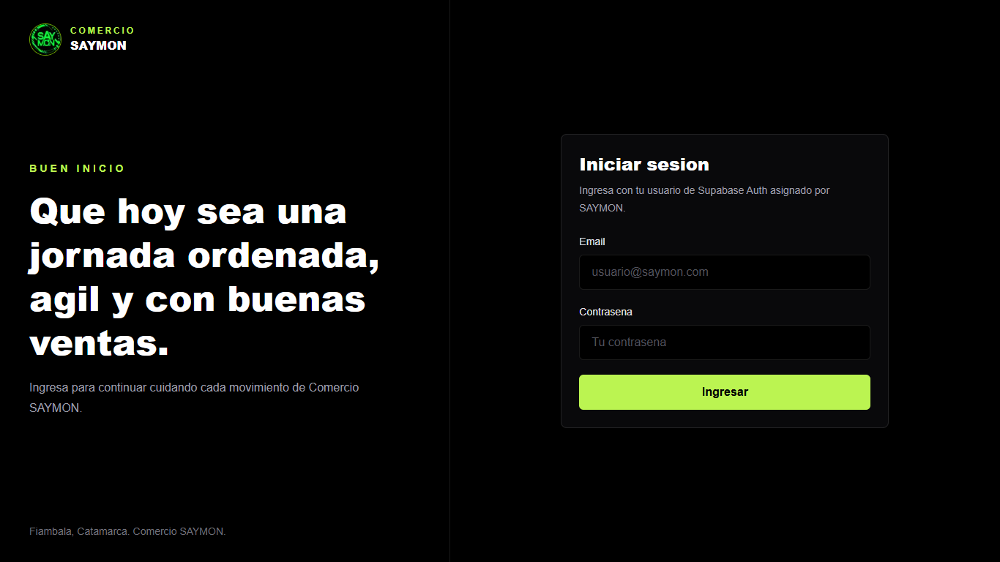

## Administracion

### Dashboard administrador

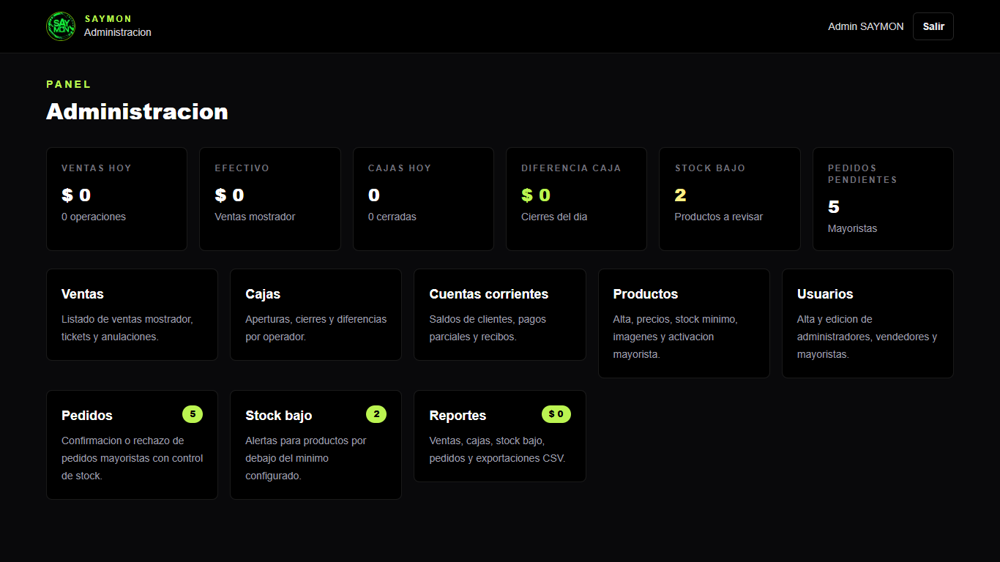

### Gestion de productos

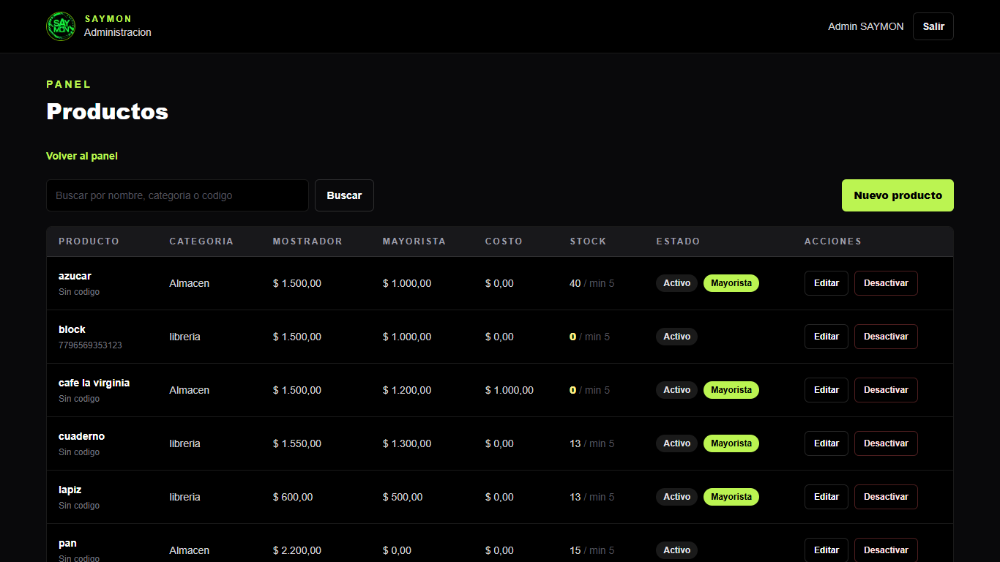

### Stock

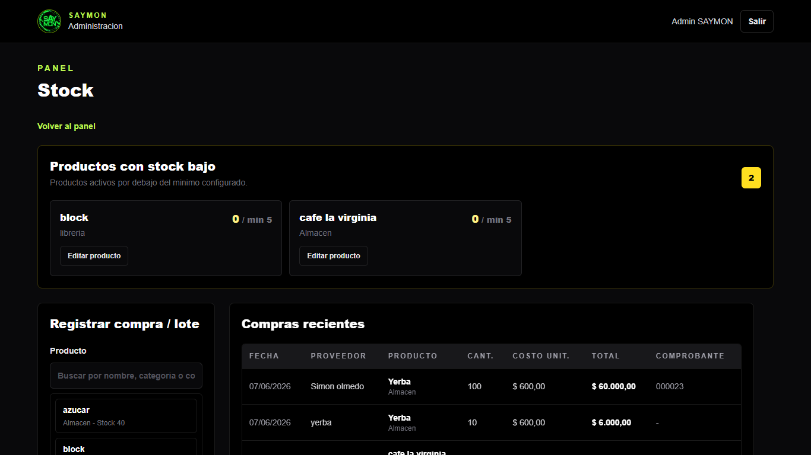

### Pedidos mayoristas

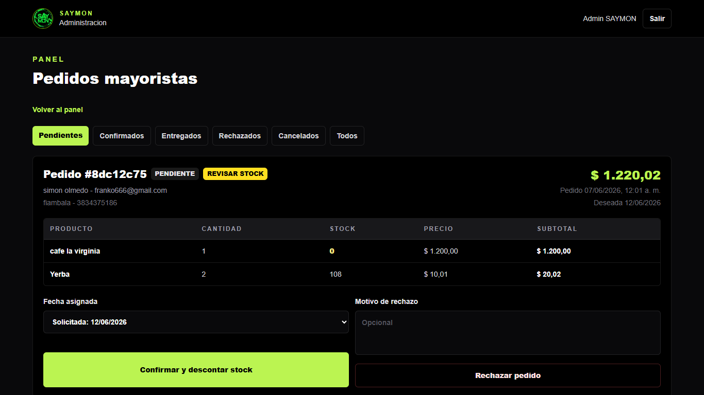

### Cuentas corrientes

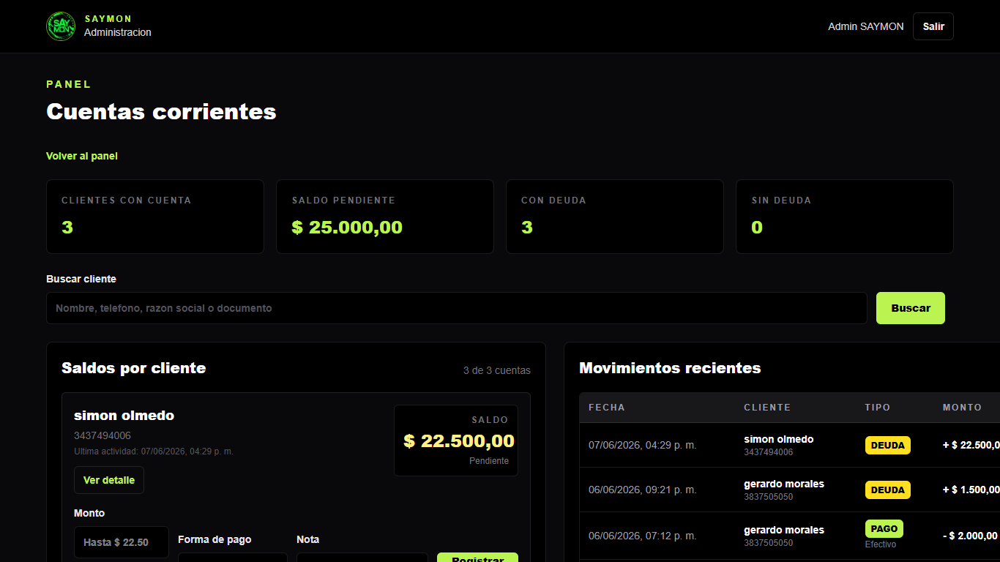

### Reportes

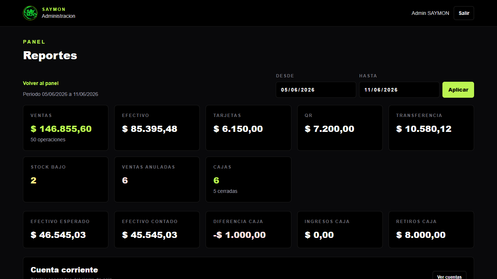

## Mostrador

### Punto de venta con carrito

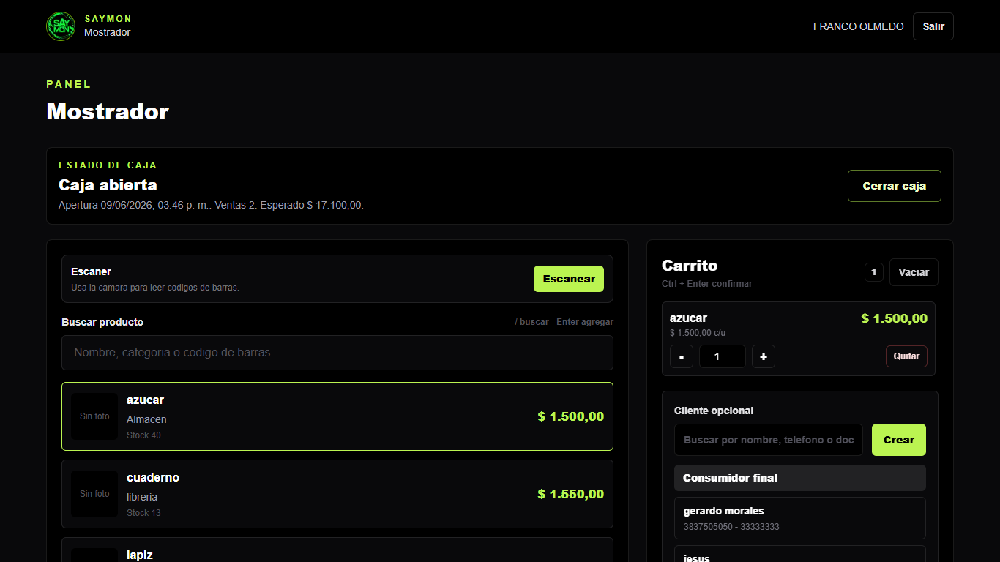

### Caja

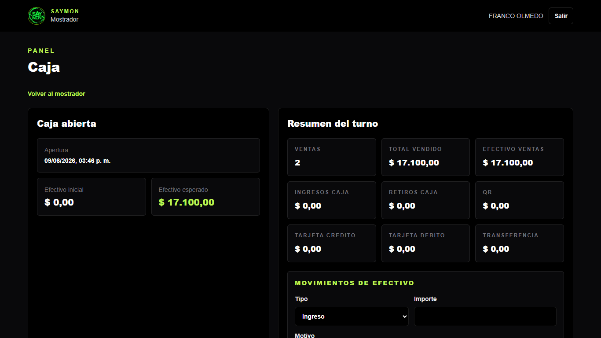

### Ticket interno

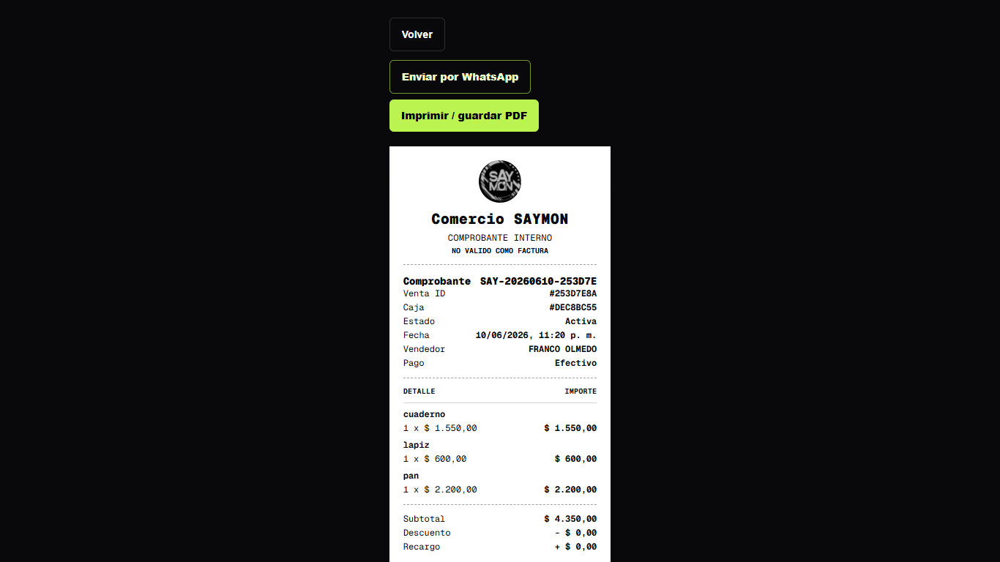

## Mayorista

### Portal mayorista con carrito

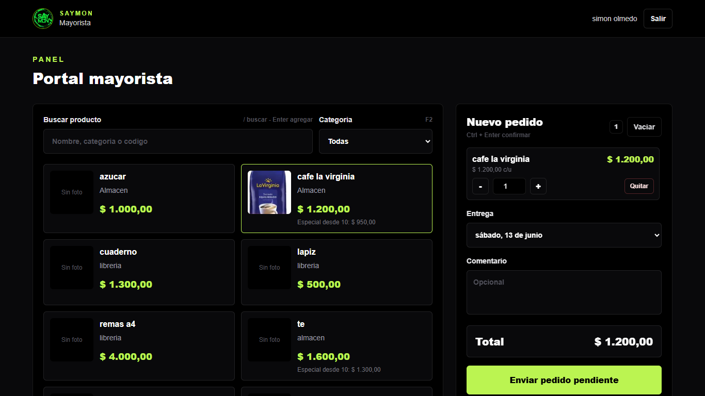

### Detalle de pedido mayorista

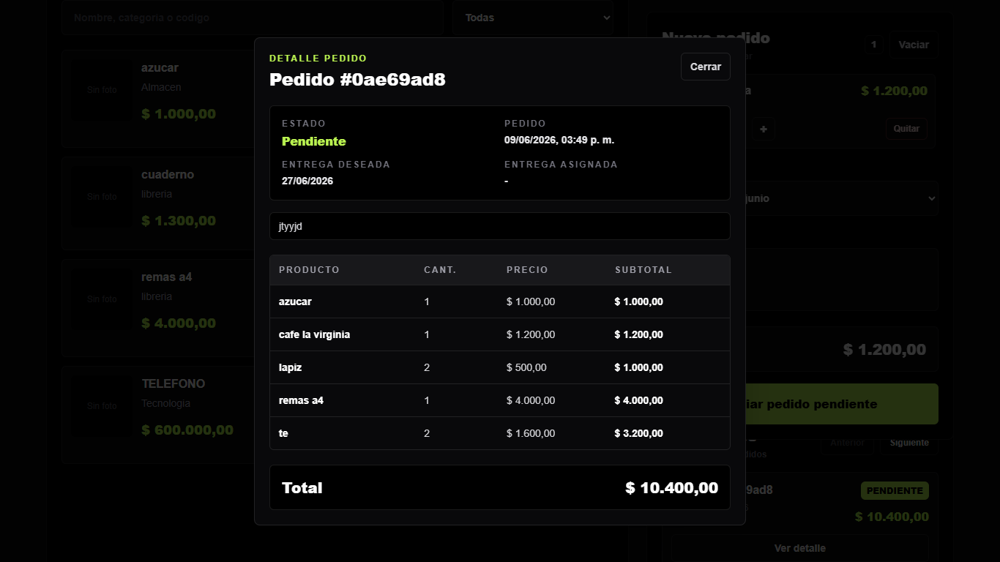
